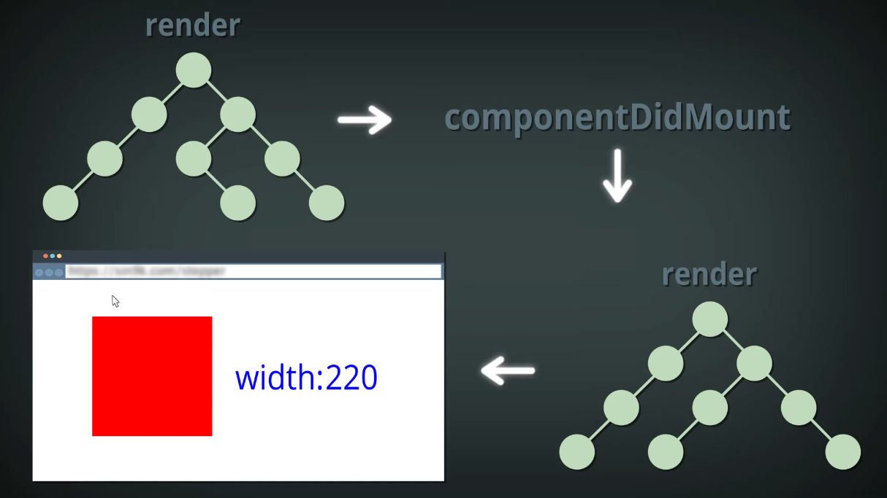
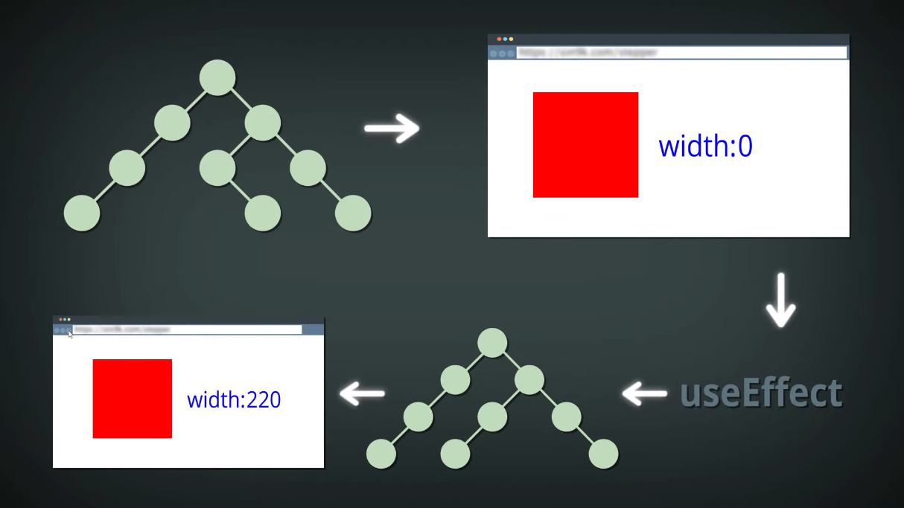

# `useLayoutEffect`
> Хук, который выполняется синхронно после всех изменений в DOM и перед следующим рендерингом

<br>

## 🚩 Синтаксис
```jsx
useLayoutEffect(callback, [depends]);
```
`callback` - функция, внутри которой будет что-то

`[depends]` - массив зависимостей

<br>

### Важно ❗

`[]` выполнится только после первого рендеринга компонента


<br>

## 🚩 Пример
```jsx
import React, { useState, useLayoutEffect } from 'react';

function SimpleLayoutEffectExample() {
    const [count, setCount] = useState(0);

    useLayoutEffect(() => {
        document.title = `Count: ${count}`;
    }, [count]);

    const increment = () => {
        setCount(count + 1);
    };

    return (
        <div>
            <p>Count: {count}</p>
            <button onClick={increment}>Increment</button>
        </div>
    );
}


```


## 🚩 Разница между `useLayoutEffect` и `useEffect`

<br>

 

<br>

`ComponentDidMount` в данном случае отображает работу `useLayoutEffect`
