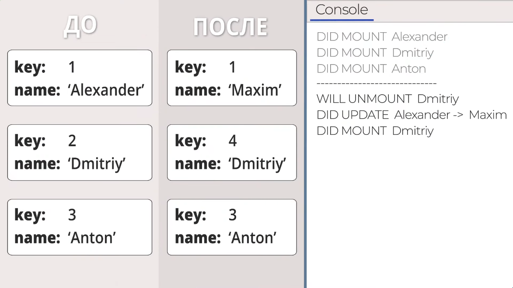
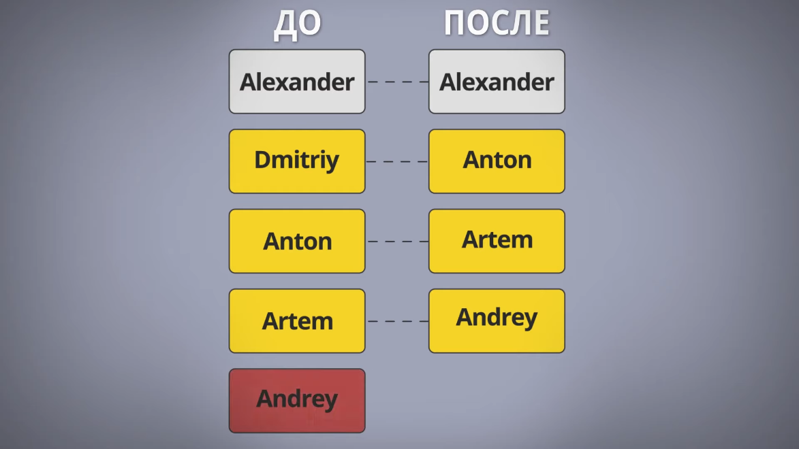

# `key`
> Обеспечивает оптимизированное и правильное обновление списков элементов
> 
> Они помогают ускорить процесс рендеринга, уменьшить нагрузку на интерфейс и обеспечить более точное отображение данных

 

## Важно ❗

Нужно описывать уникальные и стабильные `ключи`, чтобы React обновлял только нужный элемент. 

В противном случае будет обновлен весь список элементов, начиная с добавленного/удаленного 

 
Пример:

 
 

 

## 🚩 Почему не стоит использовать индекс как ключи

### Изменения порядка: 
&emsp;🔵 Если порядок элементов в списке изменится, индексы также изменятся

### Пересортировка: 
&emsp;🔵 Если элементы в списке могут быть пересортированы, индексы также изменятся

### Удаление и добавление: 
&emsp;🔵 При удалении или добавлении элемента индексы остаются, но их связь с элементами теряется

### Производительность: 
&emsp;🔵 Индексы не обеспечивают уникальность идентификации элементов, что может привести к избыточным обновлениям и снижению производительности

 
Пример:

 
 

