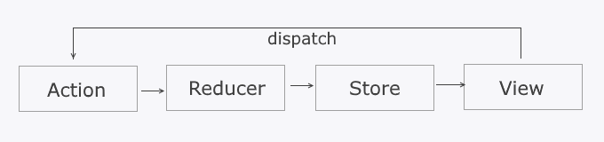

# `Redux`
> Библиотека для управлением состоянием

<br>

## 🚩 Наглядная разница

<br>


<br>

## 🚩 Как работает?

<br>



<br>

`Dispatch` - Процесс передачи действия редюсеру

`Action` - Объекты, которые описывают, что произошло в приложении.  

&emsp;&emsp;❗ Обязательно должны иметь свойство `type`

`Reducer` - Функция, которая принимает текущее состояние и действие, и возвращает новое состояние. 

`Store` - Объект, который содержит все данные

`View` - Само приложение, в котором так или иначе можно вызывать `dispatch`

<br>

## 🚩 Использование

<br>

### Создание хранилища

```jsx
// store.js
import { legacy_createStore as createStore } from 'redux';
import rootReducer from './reducers'; // Объединение редюсеров

export const store = createStore(rootReducer, composeWithDevTools);
```


<br>

### Объединение редюсеров

```jsx
// reducers.js
import { combineReducers } from 'redux';
import todoReducer from './todoReducer'; 
import otherReducer from './otherReducer';

const rootReducer = combineReducers({
  todos: todoReducer,
  otherData: otherReducer
});

export default rootReducer;

```

<br>

### Пример простого редюсера

```jsx
// cashReducer.js

const defaultState = {  // состояние по умолчанию
  cash: 6
}

export const cashReducer = (state = defaultState, action) =>{
  switch(action.type){ // обработка действий
    case 'ADD_CASH':
      return {...state, cash: state.cash + action.payload} // изменение состояния
    case 'GET_CASH':
      return {...state, cash: state.cash - action.payload}
    default:
      return state
  }
}

```

<br>

### Оболочка для приложения

```jsx
// index.js

import { Provider } from 'react-redux';
import store from './store';
import App from './App';

ReactDOM.render( // объект store будет доступен во всех дочерних компонентах 
  <Provider store={store}>  
    <App />
  </Provider>,
  document.getElementById('root')
);

```

<br>

### Хуки useDispatch и useSelector

<br>

useDispatch

```jsx
const dispatch = useDispatch();
...

const handleAddTodo = () => {
    dispatch({type: {действие}, payload: {данные}));
  };

```

