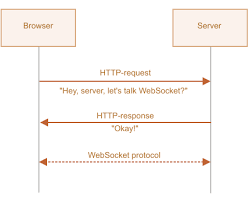

# `WebSocket`
> Протокол для постоянной двусторонней связи между клиентом и сервером

❗ Сначала осуществляется так называемое "рукопожатие", т.е отправляется обычный запрос на сервер с предложением перейти на протокол WebSocket, если ответ положительный, то они начинают работать по протоколу WebSocket

<br>

<a href="https://learn.javascript.ru/websocket">
  
</a>

<br>


## 🚩 Пример использования

```js

let socket = new WebSocket("wss://javascript.info/article/websocket/demo/hello");

socket.onopen = function(e) {
  // установливаем соединение
  alert("[open] Соединение установлено");

  // с помощью метода send осуществляем отправку данных на сервер
  alert("Отправляем данные на сервер");
  socket.send("Меня зовут Джон");
};

socket.onmessage = function(event) {
  alert(`[message] Данные получены с сервера: ${event.data}`);
};

socket.onclose = function(event) {
  if (event.wasClean) {
    alert(`[close] Соединение закрыто чисто, код=${event.code} причина=${event.reason}`);
  } else {
    // например, сервер убил процесс или сеть недоступна
    // обычно в этом случае event.code 1006
    alert('[close] Соединение прервано');
  }
};

socket.onerror = function(error) {
  alert(`[error]`);
};

```

<br>

